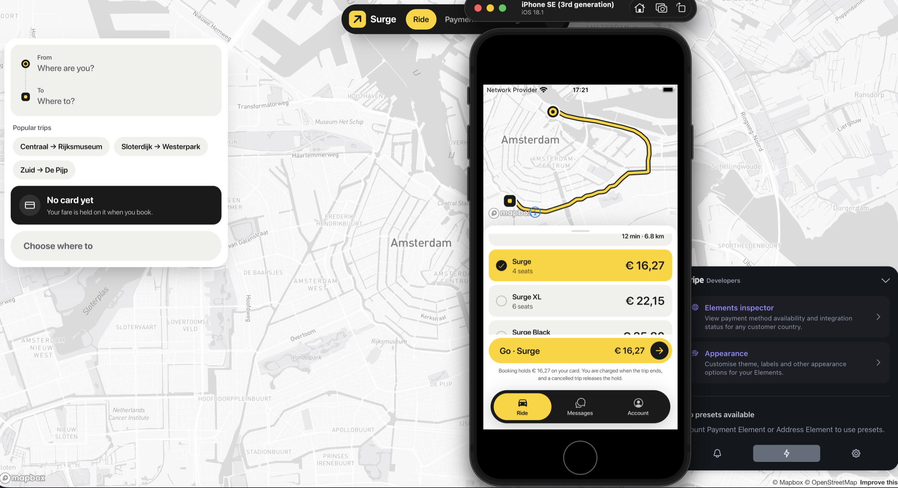

# Surge

Ride-hailing for one city. Amsterdam, one market, and the parts that are
actually hard: a geo-sharded matcher where the race condition cannot exist, a
stateful WebSocket gateway, a trip state machine that survives process death
mid-transition — and, before any of it, a driver simulator that puts tens of
thousands of cars on real roads so that every number here is measured rather
than claimed.

[](https://github.com/ishakdeveloper/surge/actions/workflows/ci.yml)



The simulator came first on purpose. Without a load generator you build the
whole system, test it with three browser tabs, and never meet a single
interesting failure mode. With one you get a knob to turn until things break.

## What is in it

Two apps and nine services, in one repository.

**Web** — TanStack Start. Riders book on a map and watch the trip; drivers go
online, take offers and get paid; ops get a live fleet map with the Kafka shard
table beside it, a support desk, and a slider that puts fifty thousand
simulated drivers on the road.

**Mobile** — Expo, iOS and Android, rider and driver. Ops stay on the web,
because a shard table on a phone helps nobody.

**Backend** — Go, one module, one directory per service:

|             | what it owns                                                                              | scales on   |
| ----------- | ----------------------------------------------------------------------------------------- | ----------- |
| `gateway`   | the only process browsers talk to: REST, WebSockets, backpressure, slow-consumer eviction | connections |
| `ingest`    | position pings, H3 cell assignment, cell transitions                                      | ping rate   |
| `matcher`   | the sharded in-memory geo index and dispatch                                              | geography   |
| `trip`      | the transactional state machine, its outbox and idempotency                               | not much    |
| `payments`  | the only holder of processor credentials — holds, captures, refunds, driver payouts       | not much    |
| `chat`      | rider↔driver and support conversations, and the push credential                           | messages    |
| `fleet`     | who may drive and what they drive: identity, vehicles, documents, review                  | drivers     |
| `core`      | names and photos, re-encoded server-side to strip EXIF                                    | not much    |
| `simulator` | the load generator, and not a product service                                             | the knob    |

**The only Node in any request path is authentication, and it is not in the
path.** `apps/auth` runs better-auth and nothing else; the browser trades its
session cookie for a short-lived EdDSA token, and every Go service verifies
that signature locally against the published JWKS.

## Five ideas worth reading the code for

**Two H3 resolutions carry the architecture.** Resolution 7 (~5 km²) is the
shard cell, which is also the Kafka message key, which makes it the unit of
ownership. Resolution 9 (~0.1 km²) is the index bucket a driver's position
lands in. Amsterdam is about 130 shard cells and 2,100 index cells.

**Matching under contention needs no lock.** Two riders, one nearby driver is
the classic race, and the usual answer is a distributed lock. Here it cannot
happen: one matcher instance owns a Kafka partition, a partition owns a set of
shard cells, and that instance is the only writer for every driver standing in
them. Searches may cross shards; reservations are routed to the shard that owns
the driver, where they are handled serially by one goroutine. The distributed
systems answer was to arrange for the shared state not to be shared.

**Everything a shard needs arrives on one topic.** `geo.events` is a tagged
union keyed by shard cell — movement, ride requests, reservations, replies —
because no consumer-group balancer guarantees co-partitioned assignment across
topics. An instance could own partition 3 of one topic and partition 5 of
another. With a single topic, owning a partition means owning every event for
those cells in total order.

**Services trade facts, not calls.** Trip publishes `trip.lifecycle`
(`TripRequested`, `TripCompleted`, …) and payments answers on `payment.events`,
both written through a transactional outbox in the same transaction as the
change they report. Trip and payments never call each other, so Stripe being
slow can delay a fare but cannot stall dispatch. The ledger is double entry: a
transaction that does not sum to zero is a constraint violation.

**A driver is approved by derivation, not by decree.** The fleet holds vehicles
and documents and works a driver's standing out from them every time it is
asked —
identity verified, one vehicle approved, every document valid today. An
inspection that lapses overnight withdraws the driver without anybody deciding
anything. The answer is published on a compacted `fleet.drivers` topic, and the
matcher follows it and dispatches nobody it does not find there.

## What was measured

Every figure below is from a run recorded in [`docs/benchmarks`](docs/benchmarks),
on one laptop — Apple silicon, 10 cores, 16 GB, with the infrastructure in
Docker beside the services. They are the shape of the system, not a capacity
plan for a real city.

|                     | measured                                                                                    |
| ------------------- | ------------------------------------------------------------------------------------------- |
| Position ingest     | 10,040 pings/sec at 40,000 drivers, age p50 10 ms, p99 50 ms, nothing stale or out of order |
| Ingest ceiling      | holds to 15,071/sec (p99 25 ms); degrades from about 20,000/sec                             |
| WebSockets          | 5,000 concurrent drivers, deepest send queue 0, no evictions, no dropped or reordered pings |
| Dispatch under load | 723 matches, 1,059 offers, 0 double dispatches — the same driver was never promised twice   |
| Index cost          | 3.96 µs per ping; 100,000 drivers is 67 MB of index                                         |

The benchmarks that failed to prove anything are in there too, because they are
the interesting ones:

**Batched matching did not beat greedy.** Gathering requests over a window and
solving them together should shorten the drive to the pickup. Across five
paired runs it moved the mean by −9 seconds with a standard error of 14 — not a
difference — while making every offer arrive about 2.3 seconds later.
`MATCH_STRATEGY` still defaults to `greedy`, and the run that argued hardest
for batching turned out to be a matcher that had lost its Kafka session.

**The learned ETA only wins at the tail.** Predicting pickup time from the
pickups the fleet actually made beats a flat 30 km/h at p90 (134 s versus
159 s) and loses at the median (33.8 s versus 25.8 s). The tail is what a rider
remembers, so it ships, with the caveat written down.

Three benchmarks also found bugs that no test would have: telemetry that walked
every driver inside the poll loop and took the p99 from 25 ms to over 30 s; a
gateway that rebuilt six hours of ghost positions on startup; and a clean
matcher handover that replayed its last seconds of work because records were
marked committed when queued rather than when handled. `make check-handover`
exists so that last one stays fixed.

## Running it

```bash
cp .env.example .env      # then set AUTH_SECRET and SIM_TOKEN_SECRET
make up                   # infrastructure; Valhalla builds tiles once, 10-20 min
make migrate

pnpm dev                  # auth on :3200 and the web app on :5273
make dev-gateway          # each Go service in its own terminal
make dev-trip
make dev-ingest
make dev-matcher
make dev-sim

make load DRIVERS=40000   # turn the knob
make stats
```

`make help` lists the rest — `dev-payments`, `dev-chat`, `dev-fleet`,
`dev-core`, `dev-mobile` for the phone, the benchmarks, and `make grant-ops
EMAIL=you@example.com` for the ops console on `/console`.

Grafana is on <http://localhost:3005> with the ingest dashboard provisioned,
Redpanda Console on <http://localhost:8080>, Jaeger on <http://localhost:16686>.

Infrastructure runs in Docker and the Go services run on the host. That is not
laziness: the reload loop becomes a compile rather than an image build, and the
8 GB Docker VM is left for Redpanda and Valhalla. `make tilt` runs the whole
thing in Kubernetes instead, and `make app-up` runs it from the images CI
builds.

## The API is generated, never written

`proto/*.proto` is the only place the REST API is declared. `make proto` turns
it into the Go gRPC services, the grpc-gateway reverse proxy, the OpenAPI
document, and — through `@effect/openapi-generator` — the TypeScript client
both apps import. Adding an endpoint is an edit to a proto file and one command.
Declaring endpoints by hand in TypeScript is the drift this arrangement exists
to prevent.

## Testing

The tests that matter here are the ones that cross a boundary no compiler
checks: the auth token's claims are verified against a **running auth service**,
because only that catches the algorithm, issuer and audience disagreeing across
two languages; routes are decoded from a **committed Valhalla fixture**, because
a precision-6 polyline read at precision 5 is a well-formed route that is wrong
by a factor of ten; the Stripe adapter runs against **Stripe's test mode** and
refuses anything but a test key; and Playwright drives **the images this commit
builds**, through sign-in, a trip from both ends, and the console.

Its first runs found three things that every unit test had passed: the web app
never sent its session cookie to auth, so every signed-in page failed with a
"Failed to fetch"; CORS allowed GET and POST while the console rescales the
simulator with PUT; and Valhalla's health check had never once passed, because
it called a binary the image does not have.

Tests that need Redpanda, Valhalla, Postgres, Stripe or auth **skip** when it is
absent, so `go test ./...` and `pnpm test` stay useful on a bare machine. CI
supplies them and runs `go test -race -cover`, staticcheck, govulncheck, `buf
breaking` against `main`, and a coverage ratchet — floors set from CI's own
numbers, allowed to rise and never to fall.

## Deploying it

`deploy/k8s` is Kustomize, a base and two overlays, one ConfigMap per workload
so that changing the matcher's search radius does not roll the gateway.
`deploy/terraform` is OpenTofu for GKE in `europe-west4`, with Workload Identity
Federation instead of a service-account key. Images are built once, scanned,
and deployed by digest: two uncached builds of the gateway produced the same
manifest digest, which is what lets an unchanged service keep its digest and not
roll.

None of it is running anywhere yet. The production overlay renders and the
Terraform validates; neither has been applied. [`docs/devops.md`](docs/devops.md)
is the plan and its current state.

## Not there yet

The fleet service — identity checks, vehicle registration, document review — has
its API, its Go, its client and its atoms, and no screen anywhere yet. There is
no rating after a trip. `proto/driver.proto` is superseded by fleet and matcher
and still has stubs lying around.

## Repository layout

```
apps/auth            better-auth, and only better-auth
apps/web             TanStack Start — console, rider, driver
apps/mobile          Expo and NativeWind — rider and driver
packages/domain      the contract both languages compile against
packages/client      platform-free Effect services over the Go API
packages/common      the atoms and helpers web and mobile share
proto/               the API contract — gRPC, REST, OpenAPI, TypeScript
backend/services/    one directory per Go service
backend/shared/      the only thing services may import
deploy/              docker, compose, k8s, terraform, dashboards
docs/benchmarks/     what was measured, and what broke
e2e/                 Playwright, against the built images
```

## Stack

Go 1.25 · Redpanda · Postgres · Valhalla · H3 · Stripe · Prometheus, Grafana,
Jaeger · Effect v4 · TanStack Start · Expo · better-auth · Kubernetes ·
OpenTofu

Built on the [forge-effect](https://github.com/ishakdeveloper/forge-effect)
boilerplate, with its server half replaced by Go.

## License

Apache 2.0 — see [LICENSE](LICENSE). The Amsterdam vehicle data comes from the
RDW's open register, and the map tiles from OpenStreetMap via Valhalla and
Mapbox, each under its own terms.
